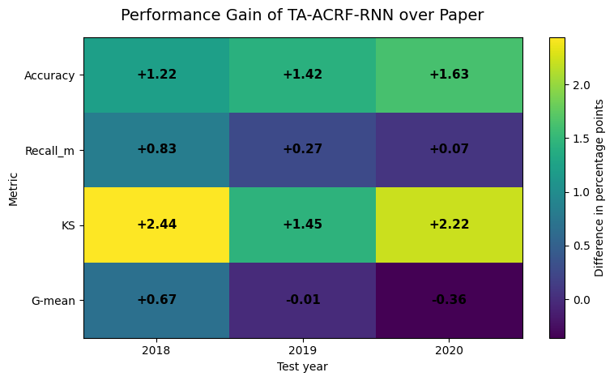

# TA-ACRF-RNN: Distributed Graph-Based Financial Fraud Detection

> Đồ án môn Dữ liệu lớn (IS405), Cơ sở dữ liệu phân tán (IS211) — Trường ĐH Công nghệ Thông tin, ĐHQG-HCM
> Nhóm thực hiện: Nguyễn Trần Thảo Nguyên (23521052), Nguyễn Thúy Ngân (23520996)
> GVHD: ThS. Nguyễn Hồ Duy Trí, ThS. Nguyễn Hồ Duy Tri

## Giới thiệu

Dự án phát hiện gian lận báo cáo tài chính (financial statement fraud) bằng
cách kết hợp học sâu trên chuỗi thời gian đa năm với phân tích quan hệ liên
công ty trên hạ tầng dữ liệu phân tán. Mô hình đề xuất, **TA-ACRF-RNN**, mở
rộng từ mô hình nền ACRF-RNN (GRU + Attention-based CRF + Focal Loss) bằng
cơ chế **time-aware relation**: thay vì chỉ dùng quan hệ giữa các công ty
trong một năm, mô hình còn khai thác quan hệ của các năm liền trước, phù
hợp với đặc điểm gian lận tài chính thường tích lũy qua nhiều kỳ báo cáo.

Dự án này **không phải** bản sao chính thức của bài báo gốc; đây là một
nghiên cứu tái hiện (reproduction) và mở rộng phục vụ mục đích học thuật.

## Điểm mở rộng chính so với bài báo nền

- Time-aware relation: khai thác quan hệ liên công ty qua nhiều năm liên tiếp.
- Masked softmax attention & CRF update ổn định hơn, huấn luyện dựa trên logits.
- Ngưỡng phân loại và epoch được chọn cố định trên tập validation 2017,
  đánh giá công bằng trên 2018–2020.
- Baseline độc lập: Random Forest, XGBoost.
- Mở rộng lưu trữ: PostgreSQL phân mảnh ngang theo năm (mô phỏng phân tán) +
  NebulaGraph lưu Cosine Graph và Attention Graph để truy vấn, trực quan hóa
  quan hệ rủi ro giữa các công ty.

## Kiến trúc hệ thống

```
Apache Spark  -->  TA-ACRF-RNN (PyTorch)  -->  PostgreSQL (bảng)
(tiền xử lý)       (huấn luyện + attention)     NebulaGraph (đồ thị quan hệ)
```

<!-- TODO: bổ sung docs/figures/architecture.png rồi bỏ comment dòng dưới -->
<!--  -->

## Phân tích dữ liệu & biểu diễn đặc trưng

Trước khi huấn luyện, dữ liệu company-year được khảo sát để hiểu phân bố và
khả năng phân tách giữa nhóm gian lận / không gian lận.

| Phân bố tổng tài sản theo nhãn                                                             | Quan hệ lợi nhuận ròng & chi phí tài chính                                                     |
| ------------------------------------------------------------------------------------------ | ---------------------------------------------------------------------------------------------- |
|  |  |

| Chiếu PCA                                          | Chiếu t-SNE                                           |
| -------------------------------------------------- | ----------------------------------------------------- |
|  |  |

## Kết quả chính (trung bình 3 năm test 2018–2020)

So với ACRF-RNN công bố trong bài báo gốc, TA-ACRF-RNN của nhóm cải thiện:

| Chỉ số   | Cải thiện trung bình |
| -------- | -------------------- |
| Accuracy | +1.42 điểm phần trăm |
| Recall_m | +0.39 điểm phần trăm |
| KS       | +2.04 điểm phần trăm |
| G-mean   | +0.10 điểm phần trăm |




| Accuracy theo từng năm test                                      | KS theo từng năm test                                |
| ---------------------------------------------------------------- | ---------------------------------------------------- |
|  |  |

## Phân tích quá trình huấn luyện


Chi tiết đầy đủ (bảng số liệu, phân tích Cosine Graph vs Attention Graph...)
xem báo cáo tại `docs/report/`.

## Cấu trúc repository

```
ta-acrf-rnn-fraud-detection/
├── data/            # graph_data, processed, raw — dữ liệu KHÔNG commit, xem .gitignore
├── database/         # app, lib, nebula, scripts, sql — tầng lưu trữ & truy vấn phân tán
├── docs/             # figures, report, slide
├── notebooks/        # 01_spark_pipeline, 02_acrf_rnn_baseline, 03_ta_acrf_rnn
├── docker-compose.yml
├── requirements.txt / requirements-spark.txt / requirements-db.txt
├── LICENSE · CITATION.cff · .gitignore
```

- `notebooks/` — 3 notebook theo đúng quy trình đã chạy (Spark, ACRF-RNN, TA-ACRF-RNN).
- `database/` — mã nguồn cho PostgreSQL phân tán và NebulaGraph (app_node điều phối
  truy vấn, schema SQL, schema/script NebulaGraph).
- `docs/` — báo cáo, slide, hình ảnh dùng trong README.

## Cài đặt

```bash
git clone https://github.com/NganNT357/ta-acrf-rnn-fraud-detection.git
cd ta-acrf-rnn-fraud-detection
python -m venv .venv && source .venv/bin/activate
pip install -r requirements.txt
```

## Tái lập kết quả (reproduce)

1. **Tiền xử lý dữ liệu**: chạy `notebooks/01_spark_pipeline/Spark_Pipeline.ipynb`
   trên máy có Spark/Ubuntu (hoặc `pip install -r requirements-spark.txt`).
   Dữ liệu đầu vào tải theo hướng dẫn tại `data/README.md` (không kèm sẵn trong repo).
2. **Huấn luyện baseline ACRF-RNN**: chạy
   `notebooks/02_acrf_rnn_baseline/ACRF_RNN.ipynb` (khuyến nghị Google Colab, GPU).
3. **Huấn luyện TA-ACRF-RNN**: chạy
   `notebooks/03_ta_acrf_rnn/TA_ACRF_RNN.ipynb`.
4. **Lưu trữ & truy vấn quan hệ liên công ty** (chạy từ thư mục gốc repo):
   ```bash
   pip install -r requirements-db.txt
   docker compose up -d
   python database/scripts/import_relationship_edges_to_nebula.py
   ```

## Bài báo nền & trích dẫn

Dự án dựa trên và so sánh với mô hình ACRF-RNN:

> X. Wang, C. Wang, L. Zhang, X. Wang, M. Wang, et al.,
> "Attention-based Conditional Random Field for Financial Fraud Detection,"
> _Proceedings of IJCAI 2025_. Code & data (bản gốc):
> https://github.com/XNetLab/ACRF-RNN

Vui lòng tham khảo và trích dẫn bài báo gốc nếu sử dụng ý tưởng ACRF-RNN;
xem thêm `CITATION.cff` và mục License bên dưới.

## Nhóm thực hiện

- Nguyễn Trần Thảo Nguyên — 23521052
- Nguyễn Thúy Ngân — 23520996
- GVHD: ThS. Nguyễn Hồ Duy Trí, ThS. Nguyễn Hồ Duy Tri

## License

Mã nguồn do nhóm tự phát triển (Spark pipeline, TA-ACRF-RNN, tầng dữ liệu
phân tán) được phát hành theo giấy phép MIT — xem `LICENSE`. Phần kiến trúc
kế thừa từ ACRF-RNN tuân theo điều khoản của repository gốc
(xem ghi chú trong `LICENSE`).
