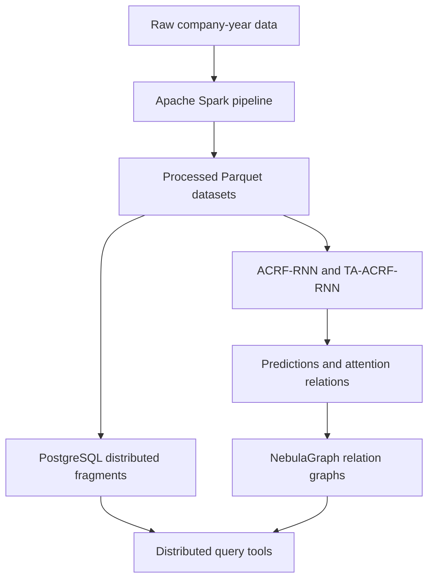
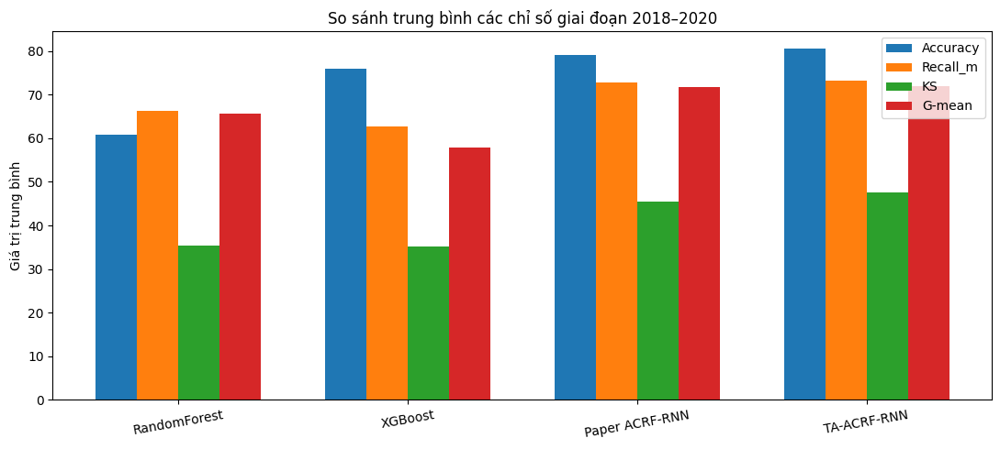
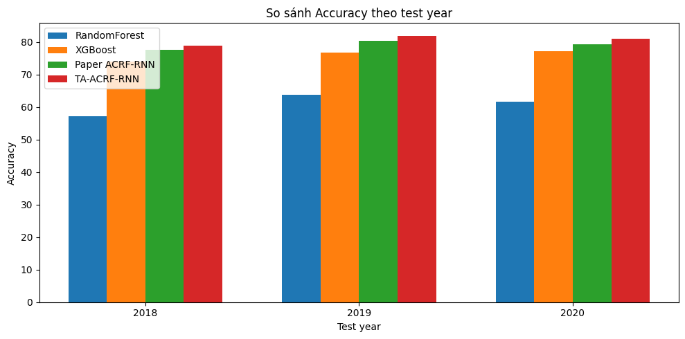
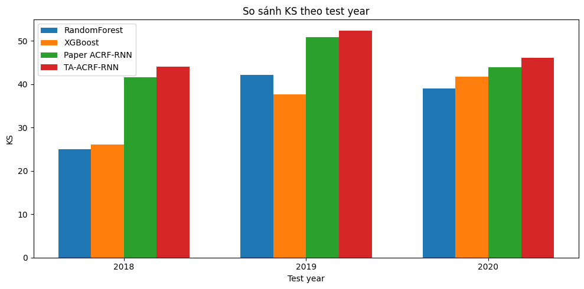
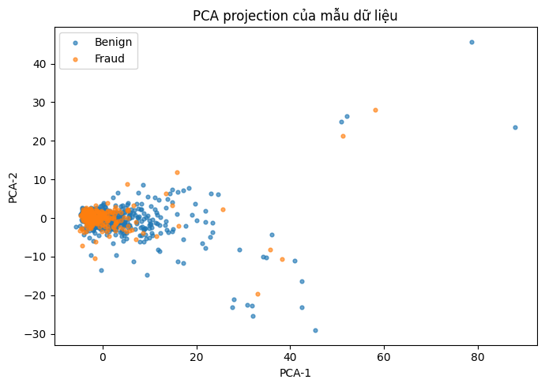
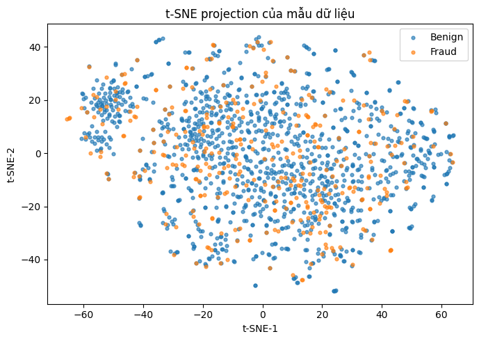
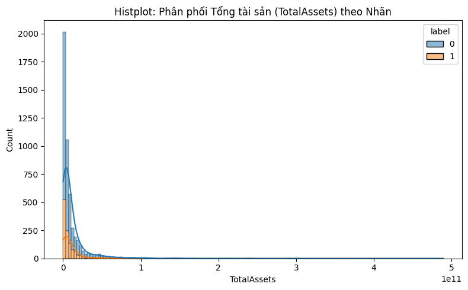
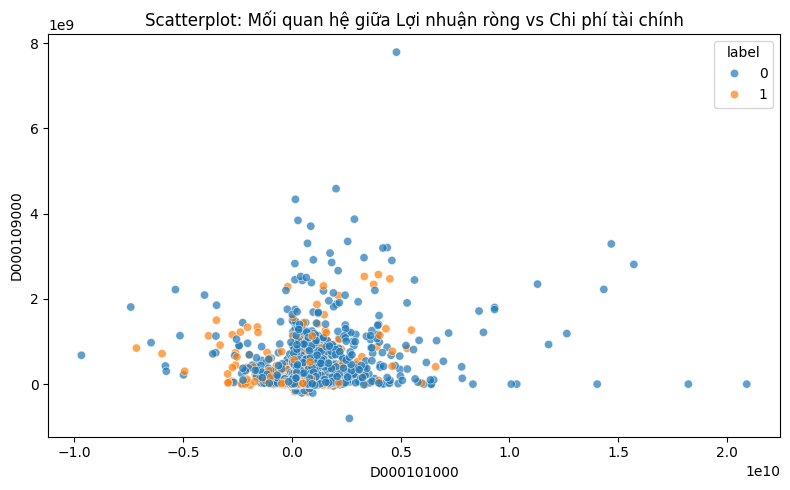
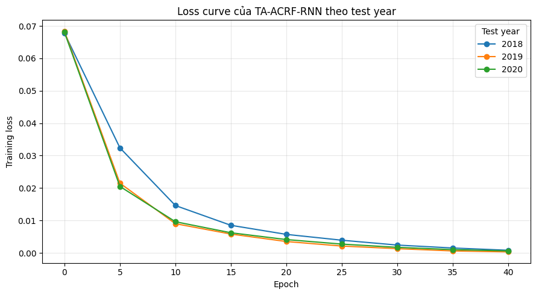
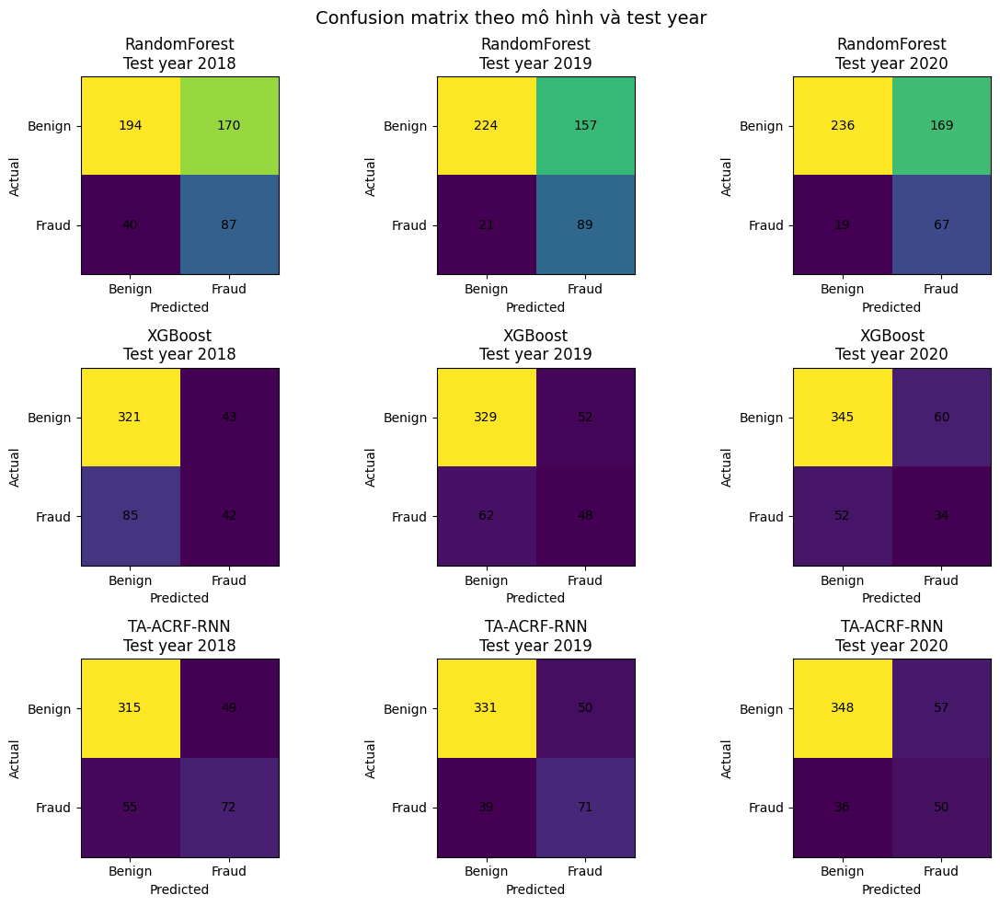

# TA-ACRF-RNN Financial Fraud Detection

> Đồ án liên môn Dữ liệu lớn (IS405) và Cơ sở dữ liệu phân tán (IS211)
>
> Trường Đại học Công nghệ Thông tin, ĐHQG-HCM
>
> Thành viên: Nguyễn Trần Thảo Nguyên (23521052), Nguyễn Thúy Ngân (23520996)
>
> Giảng viên hướng dẫn: ThS. Nguyễn Hồ Duy Trí

## Tổng quan

Dự án phát hiện gian lận báo cáo tài chính từ dữ liệu công ty theo nhiều năm. Hệ thống kết hợp Apache Spark để xử lý dữ liệu, mô hình TA-ACRF-RNN để học quan hệ theo thời gian và quan hệ liên công ty, PostgreSQL để mô phỏng phân mảnh dữ liệu theo năm, và NebulaGraph để lưu trữ, truy vấn, trực quan hóa đồ thị quan hệ.

TA-ACRF-RNN là phần mở rộng học thuật từ ACRF-RNN (IJCAI 2025). Mô hình bổ sung cơ chế **time-aware relation**, sử dụng quan hệ liên công ty của năm hiện tại và các năm liền trước thay vì xây dựng quan hệ độc lập cho từng năm.

## Điểm mở rộng chính

- Time-aware relation với trọng số thời gian `0.7`, `0.2`, `0.1` cho năm hiện tại và hai năm trước.
- Masked softmax attention và quá trình cập nhật CRF ổn định hơn.
- Huấn luyện bằng logits với focal loss; ngưỡng phân loại được áp dụng trên xác suất.
- Chọn epoch và threshold trên validation 2017; giữ nguyên thiết lập khi đánh giá 2018-2020.
- So sánh với ACRF-RNN, Random Forest và XGBoost.
- Spark pipeline tạo dữ liệu Parquet, tập train/validation/test và thống kê mô tả.
- PostgreSQL phân mảnh ngang dữ liệu theo năm; NebulaGraph quản lý Cosine Graph và Attention Graph.

## Kiến trúc hệ thống



## Dữ liệu và cách chia tập

Bộ dữ liệu gồm 491 công ty với 208 đặc trưng tài chính cho mỗi công ty-năm. Năm 2016 không có trong dữ liệu.

- Train: 2010-2015 và dữ liệu huấn luyện thuộc năm 2017.
- Validation: 2017, dùng để chọn epoch và threshold.
- Test: 2018, 2019 và 2020.
- Nhãn huấn luyện: 860 fraud và 2.577 benign.

Dữ liệu đã xử lý không được commit trực tiếp vào Git. Có thể tải `processed.zip` tại [GitHub Release v1.0.0](https://github.com/2nguyen3/financial-fraud-detection-ta-acrf-rnn/releases/tag/v1.0.0). Xem hướng dẫn chi tiết trong [`data/README.md`](data/README.md).

## Kết quả thực nghiệm

Kết quả trung bình trên ba năm test 2018-2020:

| Mô hình | Accuracy (%) | Recall_m (%) | KS (%) | G-mean (%) |
|---|---:|---:|---:|---:|
| ACRF-RNN trong bài báo | 79.16 | 72.73 | 45.46 | 71.77 |
| **TA-ACRF-RNN** | **80.58** | **73.12** | **47.50** | **71.87** |
| XGBoost | 75.97 | 62.66 | 35.14 | 57.80 |
| Random Forest | 60.90 | 66.28 | 35.42 | 65.59 |

So với kết quả ACRF-RNN được công bố, TA-ACRF-RNN cải thiện trung bình 1,42 điểm phần trăm Accuracy, 0,39 Recall_m, 2,04 KS và 0,10 G-mean.



| Accuracy theo năm | KS theo năm |
|---|---|
|  |  |

### Phân tích dữ liệu và đặc trưng

| PCA | t-SNE |
|---|---|
|  |  |

| Phân bố tổng tài sản | Lợi nhuận ròng và chi phí tài chính |
|---|---|
|  |  |

### Huấn luyện và phân loại





## Cấu trúc repository

```text
financial-fraud-detection-ta-acrf-rnn/
├── data/                 # hướng dẫn dữ liệu raw và processed
├── database/
│   ├── app/              # công cụ truy vấn và trực quan hóa
│   ├── nebula/           # schema NebulaGraph
│   ├── scripts/          # sinh và nhập dữ liệu quan hệ
│   └── sql/              # khởi tạo PostgreSQL
├── docs/
│   ├── figures/          # biểu đồ kết quả
│   ├── proposals/        # đề cương nghiên cứu của hai môn
│   └── report/           # báo cáo đồ án
├── notebooks/
│   ├── 01_spark_pipeline/
│   ├── 02_acrf_rnn_baseline/
│   └── 03_ta_acrf_rnn/
├── docker-compose.yml
├── requirements.txt
├── requirements-spark.txt
├── requirements-db.txt
├── CITATION.cff
└── LICENSE
```

## Cài đặt

```bash
git clone https://github.com/2nguyen3/financial-fraud-detection-ta-acrf-rnn.git
cd financial-fraud-detection-ta-acrf-rnn

python -m venv .venv
source .venv/bin/activate
pip install -r requirements.txt
```

Trên Windows PowerShell, kích hoạt môi trường bằng:

```powershell
.venv\Scripts\Activate.ps1
```

## Tái lập thực nghiệm

1. Tải `processed.zip` từ [release v1.0.0](https://github.com/2nguyen3/financial-fraud-detection-ta-acrf-rnn/releases/tag/v1.0.0) và giải nén vào `data/processed/`, hoặc chạy lại Spark pipeline từ dữ liệu gốc.
2. Chạy `notebooks/01_spark_pipeline/Spark_Pipeline.ipynb` nếu cần tái tạo dữ liệu đã xử lý.
3. Chạy `notebooks/02_acrf_rnn_baseline/ACRF_RNN.ipynb` để tái hiện ACRF-RNN.
4. Chạy `notebooks/03_ta_acrf_rnn/TA_ACRF_RNN.ipynb` để huấn luyện và đánh giá TA-ACRF-RNN.
5. Cài đặt và khởi động tầng cơ sở dữ liệu:

```bash
pip install -r requirements-db.txt
docker compose up -d
python database/scripts/import_relationship_edges_to_nebula.py
```

## Tài liệu dự án

- [Báo cáo môn Dữ liệu lớn](docs/report/IS405.Q21.10_23521052_23520996_BaoCao.docx)
- [Đề cương môn Dữ liệu lớn](docs/proposals/IS405_Big_Data_Research_Proposal.pdf)
- [Đề cương môn Cơ sở dữ liệu phân tán](docs/proposals/IS211_Distributed_Database_Research_Proposal.pdf)

## Bài báo nền

X. Wang, C. Wang, L. Zhang, X. Wang, M. Wang, H. Liu, and T. Qin, “Attention-based Conditional Random Field for Financial Fraud Detection,” *Proceedings of the Thirty-Fourth International Joint Conference on Artificial Intelligence*, 2025. [Paper](https://doi.org/10.24963/ijcai.2025/870) · [Official code](https://github.com/XNetLab/ACRF-RNN)

Dự án này là một nghiên cứu tái hiện và mở rộng phục vụ mục đích học thuật, không phải repository chính thức của bài báo.

## Trích dẫn và giấy phép

Thông tin trích dẫn phần mềm nằm trong [`CITATION.cff`](CITATION.cff). Mã nguồn do nhóm phát triển được công bố theo [`LICENSE`](LICENSE); các thành phần và dữ liệu kế thừa từ ACRF-RNN tiếp tục tuân theo điều khoản của repository gốc.
